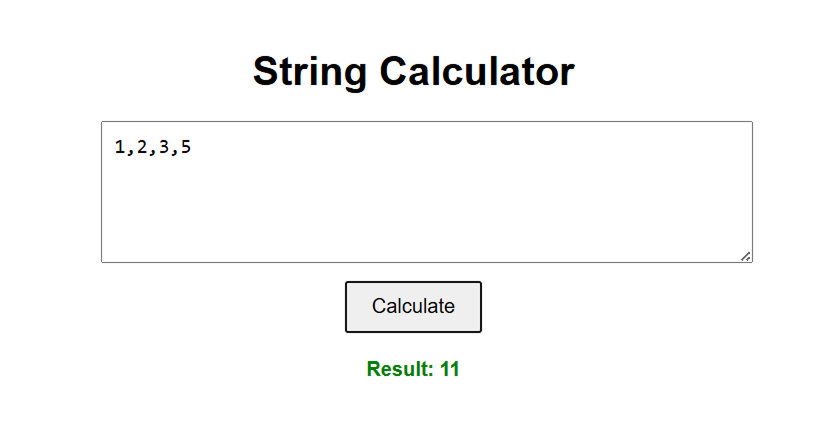

# 🧮 String Calculator TDD Kata

A simple calculator built using **React + TypeScript** that follows **Test-Driven Development (TDD)** to progressively implement string-based addition logic as per the classic [String Calculator Kata](https://osherove.com/tdd-kata-1/).

---

## 📚 Features Implemented

- ✅ Empty string returns 0
- ✅ One or two numbers return their sum
- ✅ Handles unknown amount of numbers
- ✅ Accepts newlines (`\n`) as delimiters
- ✅ Supports custom single-character delimiters (e.g., `//;\n1;2`)
- ✅ Throws error on negative numbers, listing all of them
- ✅ Ignores numbers greater than 1000
- ✅ Supports delimiters of any length (e.g., `//[***]\n1***2***3`)
- ✅ Supports multiple custom delimiters of any length (e.g., `//[*][%%]\n1*2%%3`)

---

## 🛠 Tech Stack

- ⚛️ React
- 📜 TypeScript
- 🧪 Jest + ts-jest (for testing)
- 💡 Test-Driven Development methodology

---

## 🖼 UI Preview



---

## 🧪 Test Coverage

All logic has been implemented using **strict TDD**. Every functionality is covered with unit tests in `stringCalculator.test.ts`.

To run the tests:

```bash
npm install
npm test
```
